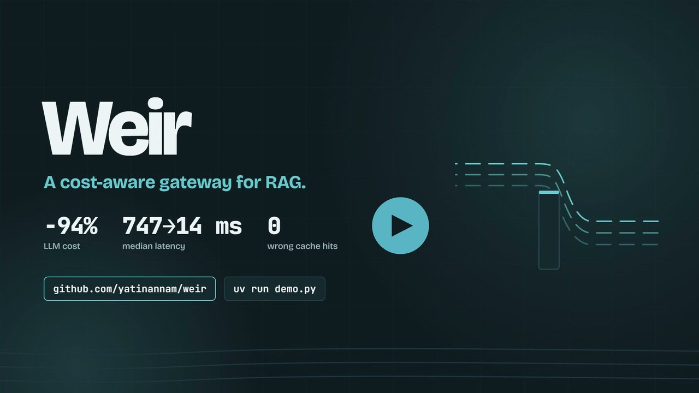
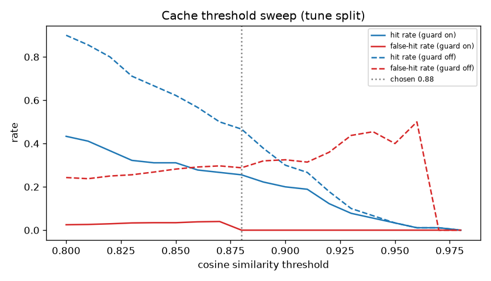
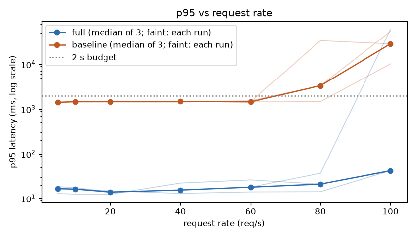
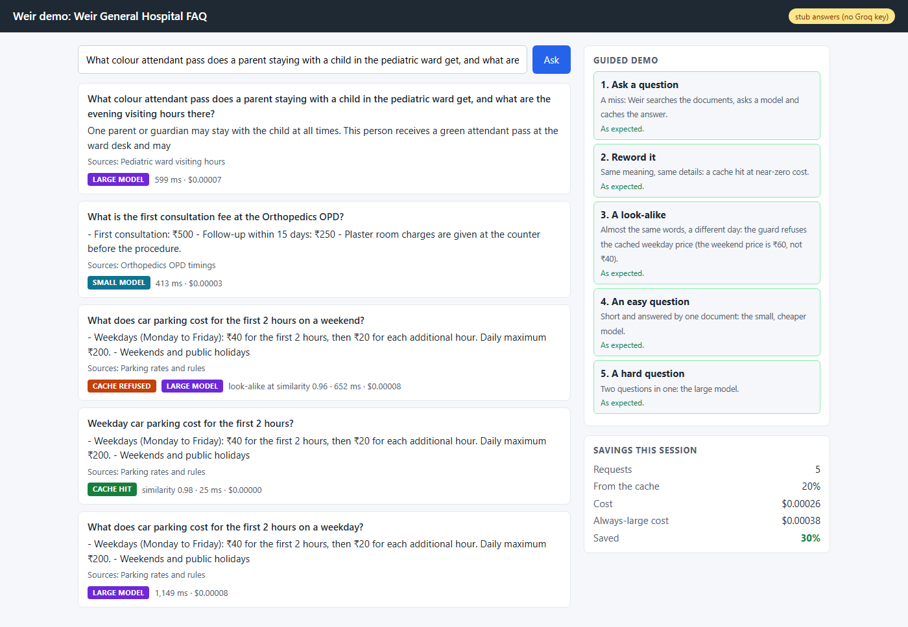
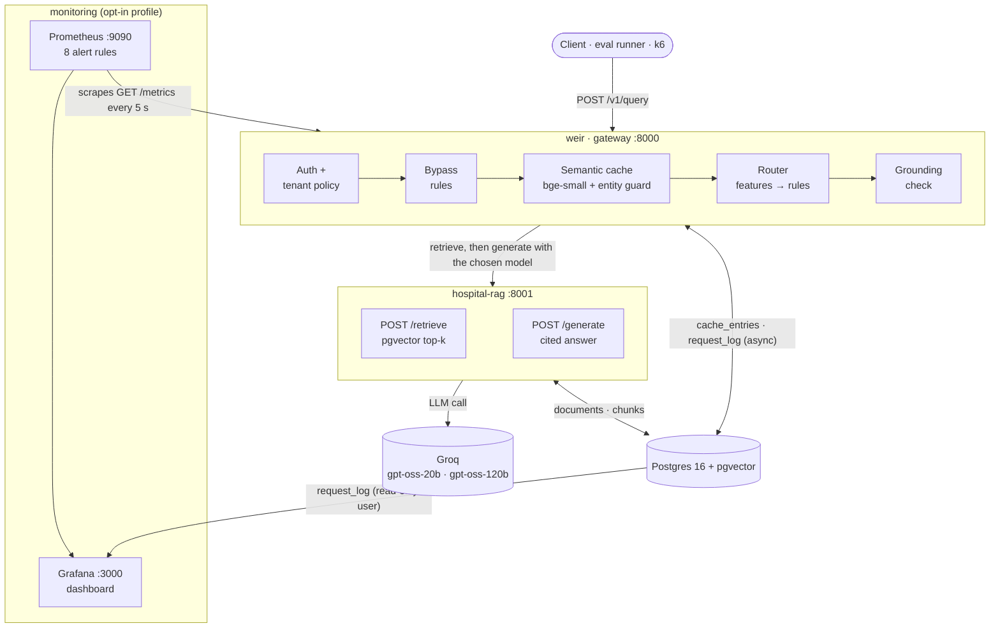
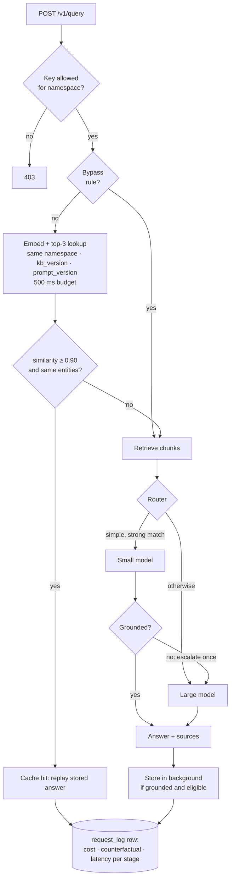
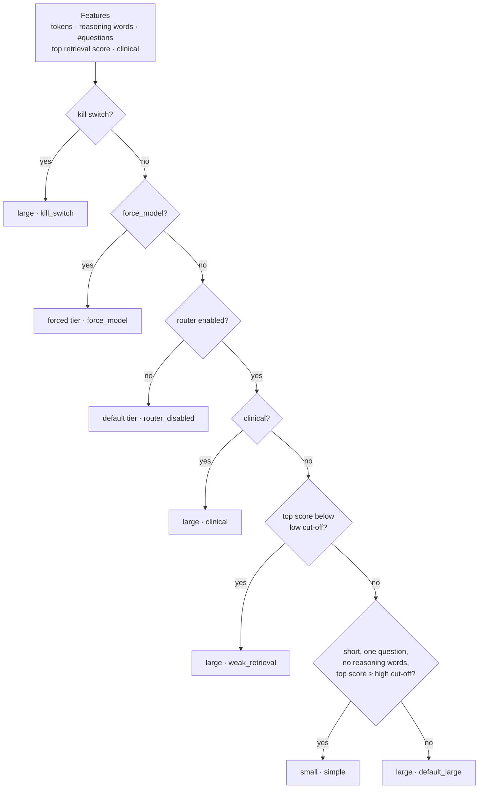
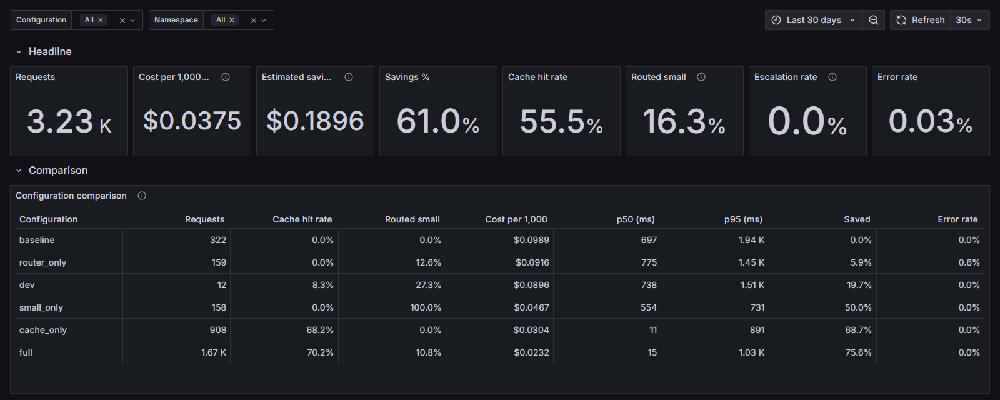

<div align="center">

# Weir

**A cost-aware gateway for RAG: a semantic cache, a model router and per-request cost accounting.**

[](https://github.com/yatinannam/weir/actions/workflows/tests.yml)


-success)
[](LICENSE)

</div>

Weir sits in front of an existing RAG service and decides, for every request:
1. Does this need an LLM call at all? This is the **semantic cache**.
2. Which model is the cheapest that can answer it well? This is the **router**.

It logs the **cost, counterfactual cost and latency of every request**, so each saving is measured, not assumed. Weir is not a retriever, vector database or LLM framework. It wraps a RAG service it does not own.

**Watch:** the [two-minute pitch video](https://github.com/yatinannam/weir/releases/download/v1.0.0/weir-pitch.mp4) · **Try it:** `uv run demo.py` · **Read:** the [case study](docs/writeup.md) ([web page](https://claude.ai/artifact/Qz1NXbjKbN3NhgN8rM2nXB)) · the [five-minute demo script](docs/demo-script.md)

<p align="center">
  <a href="https://github.com/yatinannam/weir/releases/download/v1.0.0/weir-pitch.mp4"></a>
</p>

## Contents

[Results](#results) · [Quick start](#quick-start) · [Architecture](#architecture) · [Request lifecycle](#request-lifecycle) · [Semantic cache](#semantic-cache) · [Router](#router) · [Monitoring](#monitoring) · [Stack](#stack) · [Layout](#repository-layout) · [API](#api) · [Configuration](#configuration) · [Evaluation](#evaluation) · [Tests](#tests) · [Docs](#documentation) · [Limitations](#limitations) · [License](#license)

---

## Results

These are measured on *Weir General Hospital*, a fictional hospital FAQ: 40 documents and 158 eval questions, including look-alike trap pairs. The models are real Groq models, graded by a Qwen judge plus key-fact checks. Costs are at provider list prices; actual spend is $0.

**Cold pass** (158 questions, each asked once):

| Configuration | Cache hits | Routed small | Cost / 1k req | p50 | Judge (1–5) | Key facts | Wrong cache hits |
| :-- | --: | --: | --: | --: | --: | --: | --: |
| Baseline: always the large model, no cache | 0% | 0% | $0.0988 | 767 ms | 4.90 | 0.978 | — |
| Cache only | 14.6% | 0% | $0.0847 (−14%) | 686 ms | 4.91 | 0.981 | **0** |
| Router only | 0% | 12.7% | $0.0921 (−7%) | 781 ms | 4.90 | 0.978 | — |
| **Full Weir** (cache + router) | 14.6% | 11.4% | **$0.0786 (−20%)** | 876 ms | **4.90** | **0.978** | **0** |

**Replay** (300 requests, Zipf-skewed, 73.7% repeats):

| Configuration | Cache hits | Cost / 1k req | p50 | Judge (1–5) | Key facts | Wrong cache hits |
| :-- | --: | --: | --: | --: | --: | --: |
| Baseline (derived per question) | 0% | $0.0970 | 747 ms | 4.79 | 0.947 | — |
| Cache only | 93.3% | $0.0050 | 56 ms | 4.79 | 0.948 | **0** |
| **Full Weir** | **93.0%** | **$0.0055 (−94%)** | **14 ms** | **4.79** | **0.948** | **0** |

- **On repeat-heavy traffic, full Weir cuts cost per 1,000 requests by 94% and median latency by about 50× (747 ms → 14 ms), with quality equal to the baseline on the same mix.** On a cold pass, where only paraphrases repeat, it still saves 20% with identical judge and facts.
- **The router adds a modest, safe saving.** It sends 13% of questions to the small model, which answered every one of them at 5/5 with full facts. That cuts router-only cost by 7% with judge and facts unchanged. The strict "no visible loss" bar limits it; a looser bar would have saved ~38% at the cost of 2 wrong answers in 158 ([`router-tuning.md`](docs/results/router-tuning.md)).
- **It degrades gracefully.** When Groq's large model failed (HTTP 502s, then a daily rate limit), Weir fell back to the small model: **0 errors across 1,232 live requests on 2026-10-05**.
- **The entity guard is what makes caching safe.** At the chosen 0.90 threshold, embedding similarity alone would serve the wrong answer for **37%** of accepted matches (for example "ICU visiting hours" vs "general ward visiting hours"). With the guard, that drops to **0%**.

<p align="center">
  
</p>

Phase 3 rows are compared with baseline v4, re-run on 2026-10-05 because the large model drifted between runs; full Weir was measured on 2026-10-06 with the final settings (D39, D40). Full write-ups:
- [`summary.md`](docs/results/summary.md): the four-way ablation, both workloads
- [`router.md`](docs/results/router.md): live router results, exit gate, the two outage incidents
- [`router-tuning.md`](docs/results/router-tuning.md): offline tuning and the option not taken
- [`cache-only.md`](docs/results/cache-only.md), [`cache-threshold.md`](docs/results/cache-threshold.md), [`baseline.md`](docs/results/baseline.md)

### Under load (stub model)

Phase 5 drove Weir with k6 at a constant arrival rate. Retrieval, embeddings, the cache and the router are real; the model is a stub whose delays are fitted to measured Groq latencies (small 553 / 830 ms, large 748 / 1,429 ms median / p95), so no quota was spent. The workload is 3,000 Zipf-skewed requests (94.8% repeats). Every number is the median of 3 runs, with the range in the [full report](docs/results/loadtest-2026-10-07.md).

**Four-way at 10 req/s for 5 min, starting from an empty cache:**

| Configuration | p50 | p95 | p99 | Hit rate | Errors |
| :-- | --: | --: | --: | --: | --: |
| Baseline: always the large model, no cache | 772 ms | 1,439 ms | 1,797 ms | 0% | 0% |
| Cache only | 10 ms | 41 ms | 1,072 ms | 95.4% | 0% |
| Router only | 730 ms | 1,405 ms | 1,831 ms | 0% | 0% |
| **Full Weir** | **10 ms** | **33 ms** | 1,002 ms | 95.4% | 0% |

- **With a warm cache, full Weir's p95 is 15 ms against the baseline's 1,439 ms (99% lower)** at 10 req/s.
- **Full Weir held 100 req/s at a p95 of about 41 ms in 2 of 3 ramps; the baseline held 60 req/s at about 1.5 s.** A step only counts if k6 sent every request on time (no dropped iterations), p95 stayed within 2 s and errors within 1%. In the third ramp, full Weir collapsed at 100 req/s: once cache lookups began timing out under CPU load, 1,832 requests bypassed to retrieval and the model, which added load until requests hit k6's 60 s timeout. That's a real overload mode, now in the backlog (M31).
- **Failures stayed invisible to users: 0 errors in every phase of 3 failure runs.** Across the 3 runs, with the large model rate-limited, 541 requests fell back to the small model; with the small model timing out, 60 fell back to the large one. With Weir's database link delayed by 2 s, the cache was bypassed 1,191 times; the median p95 was 1,943 ms, inside the 2 s budget, though one of the 3 runs reached 2,068 ms.
- **A 60 req/s burst never left the budget** (worst 10-second p95: 22 ms). Over **30 minutes at 10 req/s**, p95 moved from 13.1 to 14.6 ms with 0 errors; memory held at about 250 MiB for the 25 minutes it was sampled, but `docker stats` returned nothing for the last 5, so the no-leak check is recorded as incomplete.

<p align="center">
  
</p>

## Quick start

**Prerequisites:** Docker Desktop (running) and [uv](https://docs.astral.sh/uv/). A free [Groq API key](https://console.groq.com/keys) is optional.

```bash
uv run demo.py
```

That one command creates `.env` with fresh keys, starts the stack, loads the knowledge base, empties the demo cache and opens the demo page at <http://127.0.0.1:8000/demo>. Without a Groq key it uses the stub model: retrieval, the cache, the guard and the router are real, the generated answers are simulated, and the page says so. Add your key to `.env` as `GROQ_API_KEY` and run it again for real model answers. `uv run demo.py --stop` stops everything; `--dashboard` also starts Grafana; `--check` runs the guided story without a browser.

<p align="center">
  
</p>

The guided sidebar walks the five-minute story, shown above with real Groq answers:
1. **A weekday parking question:** a miss, answered by the large model (₹40).
2. **The same question reworded:** a cache hit at similarity 0.98, in 23 ms, at no cost.
3. **The weekend look-alike:** similarity 0.96, but the entity guard refuses the cached weekday answer, and the model answers ₹60.
4. **An easy question:** the small model.
5. **A hard, two-part question:** the large model.

### Manual setup

```bash
cp .env.example .env
# Fill in GROQ_API_KEY, then generate three tenant keys (WEIR_KEY_PUBLIC / _STAFF / _ADMIN):
uv run python -c "import secrets; print(secrets.token_urlsafe(24))"

docker compose up -d --build                     # postgres, migrations, hospital-rag, weir
docker compose exec hospital-rag python -m hospital_rag.ingest --kb /app/kb
```

> [!TIP]
> **On Windows:**
> - In Git Bash, prefix the `exec` command with `MSYS_NO_PATHCONV=1`.
> - Use `127.0.0.1` rather than `localhost`, which can stall on IPv6.

Ask the same question twice. The second time it is a cache hit:

```bash
curl -s http://127.0.0.1:8000/v1/query \
  -H "X-API-Key: $WEIR_KEY_PUBLIC" -H 'content-type: application/json' \
  -d '{"query": "What are the ICU visiting hours?", "namespace": "weir-general/en/public"}'
```

```json
{
  "answer": "The ICU can be visited twice daily: 11 am – 11:30 am and 5 pm – 6 pm…",
  "sources": [{ "id": "pub-visiting-hours-icu", "title": "ICU visiting hours" }],
  "meta": {
    "request_id": "…",
    "cache_status": "hit",
    "similarity": 1.0,
    "route": "none",
    "escalated": false,
    "model": "openai/gpt-oss-120b",
    "latency_ms": 7,
    "cost_usd": 0.0,
    "counterfactual_cost_usd": 0.00009,
    "guard_refused": false,
    "fallback": false
  }
}
```

Interactive API docs are at <http://127.0.0.1:8000/docs>. Set `LLM_MODE=stub` in `.env` to run without Groq: the stub answers from the first retrieved passage after a per-model delay fitted to measured Groq latencies (`STUB_TIMING=realistic`, the default; `fixed` gives a constant delay).

## Architecture



| Service | Role | Owns |
| :-- | :-- | :-- |
| `weir` | The gateway: auth, cache, router, cost accounting, admin API | `weir.cache_entries`, `weir.request_log`, `weir.feedback`, `weir.model_prices` |
| `hospital-rag` | The RAG service being wrapped: ingest, vector retrieval, cited generation, stub LLM mode | `rag.documents`, `rag.chunks`, `rag.kb_versions` |
| `postgres` | pgvector 0.8 with HNSW and iterative scan; only exposed on `127.0.0.1` | — |
| `prometheus`, `grafana` | Monitoring, opt-in with `--profile monitoring`; provisioned entirely from files in `monitoring/` | Prometheus TSDB (15 days) |

## Request lifecycle



Every response carries `X-Request-ID`, which is also the primary key of its log row. The log is written off the request path, so a logging failure never fails a request.

## Semantic cache

| Stage | What happens |
| :-- | :-- |
| **Bypass** | Personalised, time-sensitive ("now", "today"), clinical and follow-up questions never touch the cache. Neither do forced-model requests, a disabled namespace or the kill switch. |
| **Lookup** | The normalised query is embedded with local `bge-small-en-v1.5` (384-d). pgvector returns the top 3 entries for the same `namespace + kb_version + prompt_version` that haven't expired. The step has a 500 ms budget; on timeout the request bypasses the cache. |
| **Entity guard** | A candidate at or above the 0.90 threshold is a hit only if both questions share the same numbers (including number words and ordinals), negation and lexicon terms: wards, departments, people, vehicles, payment, days, buildings and more. The lexicon is in [`entities.yaml`](configs/entities.yaml). |
| **Write-back** | An answer is stored in the background only if it is grounded and cited, retrieval was confident, it isn't "couldn't find" and it wasn't truncated, partial or carrying personal data. |
| **Invalidation** | TTL of 24 h. A `kb_version` change (a content hash of the documents) is picked up by the next miss. `DELETE /v1/cache` purges by namespace, source document or entry. A thumbs-down evicts the entry that served it. |

## Router



- **Grounding check** (rule-based, no extra LLM call). An answer passes only if:
  - it was found and finished
  - it cites at least one chunk, and every citation is valid
  - it didn't give up partway ("NOT_FOUND" mid-answer)
  - at least `min_overlap` of its content words appear in the cited chunks
- **Escalation and fallback:**
  - A small answer that fails grounding is retried once on the large model.
  - A rate-limited or timed-out tier falls back to the other tier.
  - Never more than 2 model calls per request.
  - Forced and disabled routes never adapt.
  - An answer from a fallback down to the small model is never cached, so a stand-in answer can't outlive an outage (D40).
- **Offline tuning.** The cut-offs are tuned without a single model call: the router replays both models' measured answers to all 158 questions over a grid of 5,400 settings. The cheapest setting that meets the quality bar wins. The bar is "no visible loss" (D33):
  - judge within 0.1 of the baseline
  - facts no lower
  - the small route no worse than the large model on the same questions
- **Tuned values** (D37, D39): small only if the question is at most **16 tokens**, a single question with no reasoning words, and its top retrieval score is at least **0.86**; grounding `min_overlap` **0.3**. The live router matched the simulation almost exactly: 12.7% routed small vs 13% predicted, −7% vs −6%.

## Monitoring

<p align="center">
  
</p>

```bash
uv run demo.py --dashboard                      # the stack plus Prometheus and Grafana
docker compose --profile monitoring up -d       # or add them to a stack you started by hand
```

- **Grafana:** <http://127.0.0.1:3000>. The user is `admin` and the password is `GRAFANA_ADMIN_PASSWORD` from `.env`.
- **Prometheus alerts:** <http://127.0.0.1:9090/alerts>
- **Full dashboard screenshot:** [`docs/images/dashboard.png`](docs/images/dashboard.png)

**What it shows:** the dashboard reads the request log, so it covers **every run Weir has ever served**, not just live traffic. A **configuration filter** (`baseline` / `cache_only` / `router_only` / `full`) switches the whole view.

| Row | Source | Panels |
| :-- | :-- | :-- |
| Headline | Postgres | Requests, cost per 1,000, estimated savings ($ and %), cache hit rate, share routed small, escalation rate, error rate |
| Comparison | Postgres | The four-way ablation as one live table: hit rate, small share, cost per 1,000, p50/p95, savings, errors per configuration |
| Where requests go | Postgres | Route mix over time, cache status, top bypass reasons |
| Latency | Postgres | p50/p95/p99 by path (cache hit, small, large); average time per stage (embed, cache lookup, retrieval, model) |
| Cache and router health | Postgres | Similarity histogram for hits and near misses, route reasons, grounding results, fallbacks and escalations over time, thumbs-down count |
| Live | Prometheus | Requests per second, p95, errors per second, lost background work, firing alerts, running configuration |

**How it's built:**
- **Weir's metrics:** Weir exposes **`GET /metrics`**. Its counters are derived from the same per-request row that goes to Postgres, so the live and historical numbers can't disagree.
- **Never on `/metrics`:** question text and request IDs.
- **Grafana's database access:** Grafana reads Postgres as a **read-only user** (`weir_reader`).
- **Where the panels come from:** a small Python builder generates the dashboard JSON. A test runs every panel query as that user against seeded data.

**Alerts** are shown in Grafana and Prometheus only, with no notifications. Their thresholds come from measured runs, and each rate alert needs a minimum amount of traffic, so an idle machine never alerts.

| Alert | Fires when | Severity |
| :-- | :-- | :-: |
| `WeirDown` | Prometheus can't scrape Weir for 1 minute | critical |
| `HighErrorRate` | over 5% of requests fail over 10 minutes | critical |
| `HighLatencyP95` | p95 of non-hit requests over 4 s for 10 minutes (normal: 1.1–3.5 s) | warning |
| `ModelFallbacks` | any fallback to the other model tier in 5 minutes | warning |
| `HighEscalationRate` | over 20% of small-model answers escalated over 30 minutes | warning |
| `CacheHitRateDrop` | the 15-minute hit rate (hits / cache lookups) falls below half its 6-hour average | warning |
| `CostAboveBaseline` | the last hour's cost is over 5% above what the same traffic would cost with no cache and always the large model | warning |
| `BackgroundWorkLost` | any request-log row or cache job dropped or failed | warning |

Prometheus's `promtool` runs 22 alert unit tests in CI:
- Each alert has a firing case and a quiet case, and each rate alert also has a low-traffic case.
- Three more scenarios come from normal workflows: a `baseline` run, cache-heavy traffic with a slow model, and hits vanishing after a restart.

The series the alerts use exist at 0 from startup, so the first fallback or error after a restart is never missed.

## Stack

| Layer | Choice | Why |
| :-- | :-- | :-- |
| API | Python 3.12, FastAPI, uvicorn, `uv` | Async I/O, typed request models, fast installs |
| Vector store | Postgres 16 + pgvector 0.8 (HNSW, `iterative_scan = relaxed_order`), psycopg 3 async pool | One database for vectors, cache metadata and logs; filtered ANN without recall loss |
| Embeddings | `BAAI/bge-small-en-v1.5` via fastembed (CPU, baked into images) | Free, offline, no PyTorch |
| LLMs | Groq free tier: `openai/gpt-oss-20b` (small), `openai/gpt-oss-120b` (large) | Fast; separate per-model quotas allow fallback |
| Eval judge | `qwen/qwen3.8-27b` on Groq | A different model family from the models under test |
| Monitoring | Prometheus (`prom/prometheus:v2.55.1`), Grafana OSS (`11.3.0`), `prometheus-client` | Standard, free and self-hosted; provisioned from files, so there's no clicking to set up |
| Load testing | k6 (`grafana/k6:0.54.0`), Toxiproxy (`2.9.0`), a stub model with per-model timing fitted to measured Groq latencies | Repeatable and free: no model quota spent; faults injected per model and on Weir's database link |
| Packaging and CI | Docker Compose (with profiles), a standard-library launcher (`demo.py`), GitHub Actions (3 test suites against pgvector, launcher tests, `promtool` config and rule tests, `k6 inspect`) | — |

## Repository layout

```text
services/
├── weir/               gateway
│   └── src/weir/
│       ├── pipeline.py     request pipeline: bypass → cache → retrieve → route → generate → log
│       ├── cache/          embedder, pgvector store, entity guard, bypass rules, kb versions
│       ├── router/         features, rules v1, grounding check            (Phase 3)
│       ├── rag/            hospital-rag HTTP adapter
│       ├── metrics/        async request-log writer, Prometheus metrics            (Phase 4)
│       ├── demo/           the demo page and its five guided questions             (Phase 6A)
│       └── llm/            price table (effective-dated)
└── hospital-rag/       the RAG service Weir wraps: ingest, /retrieve, /generate, stub LLM
eval/                   eval set (158 questions), key-fact checks, LLM judge, runner,
                        threshold sweep, workload replay, load-test orchestrator and report;
                        reports/ holds every raw result
loadtest/               k6 scripts, request files (no keys), Toxiproxy config; results/ holds every run
demo.py                 one-command demo launcher (uv run demo.py); tests/ holds its tests
scripts/                demo_smoke.py: live Playwright check of the demo page and its screenshot
kb/                     fictional hospital knowledge base (40 Markdown docs, public + staff)
configs/                weir.yaml (every threshold), ablations/, entities.yaml, tenants.yaml, prices.yaml
monitoring/             prometheus.yml, alert rules and their tests, Grafana provisioning, dashboard builder,
                        live panel check, screenshot script
db/migrations/          001 init · 002 cache · 003 router · 004 monitoring (read-only user)
docs/                   specs, plans, decision log, progress log, results, backlog
```

## API

| Endpoint | Auth | Purpose |
| :-- | :-- | :-- |
| `POST /v1/query` | tenant key | Answers a question. Body: `query`, `namespace`, optional `session_id` and `personalized`, `options.bypass_cache`, `options.force_model` (`small` or `large`). |
| `POST /v1/feedback` | tenant key | Body: `request_id`, `rating` (`1` or `-1`), optional `comment`. A `-1` evicts the cache entry that served the request. |
| `DELETE /v1/cache` | admin key | Purges by exactly one of `namespace`, `source_id` or `entry_id`. |
| `GET /healthz` | none | Database and RAG health, plus the active `config_label`. |
| `GET /metrics` | none (localhost and Docker network only) | Prometheus text format: requests, latency histogram, cost and counterfactual, model calls, escalations, fallbacks, grounding, lost background work. |

Errors carry the `request_id`:
- a provider rate limit → `503` with `Retry-After`
- a timeout → `504`
- a bad upstream response → `502`

## Configuration

Every threshold lives in [`configs/weir.yaml`](configs/weir.yaml), and unknown keys are rejected:
- cache: threshold, candidates, TTL, lookup budget
- bypass keyword lists
- models
- router cut-offs and reasoning words
- grounding `min_overlap`
- kill switches
- per-namespace policy

Experiments change config, not code. Ablations are overlays selected with `WEIR_ABLATION=<name>`:

| Overlay | Cache | Router | Purpose |
| :-- | :-: | :-: | :-- |
| `baseline` | off | forced large | The "before" number |
| `cache_only` | on | forced large | Phase 2 result |
| `small_only` | off | off, small | Small-model trial for offline tuning |
| `router_only` | off | on | Router on its own |
| `full` | on | on | Full Weir |

## Evaluation

Every answer is scored two ways:
- **key facts:** canonicalised whole-number matching against the answer key
- **an LLM judge:** a 1–5 rubric, with a disk cache and resumable grading

```bash
cd eval
uv run --env-file ../.env python -m weir_eval validate                    # check the question set against the KB
uv run --env-file ../.env python -m weir_eval run --config baseline --split all --no-judge \
  --weir-url http://127.0.0.1:8000
uv run --env-file ../.env python -m weir_eval rejudge reports/<run>       # grade later; resumable
uv run python -m weir_eval sweep                                          # threshold sweep, no LLM calls
uv run python -m weir_eval make-workload --n 300 --seed 7                 # Zipf-skewed replay order

# Phase 3 router tuning and checks (no model calls)
uv run python -m weir_eval features                                       # router inputs for every question
uv run python -m weir_eval export-grounding reports/<small-trial>         # grounding results from the request log
uv run python -m weir_eval simulate --small reports/<small-trial>         # replay both models over the rule grid
uv run python -m weir_eval gate reports/<run>                             # exit gate vs baseline v3, same questions
uv run python -m weir_eval derive-workload reports/<run> --workload datasets/workload-300-seed7.jsonl --out reports/<name>
```

| Question group | Count | Purpose |
| :-- | --: | :-- |
| Distinct | 35 | Coverage of the KB |
| Paraphrase clusters (13 × 5) | 65 | Cache recall |
| Look-alike trap pairs (24 pairs) | 48 | Cache safety: same wording, different answer |
| Unanswerable | 10 | "Couldn't find" behaviour, never cached |

The set is split 70/30 by cluster into tune and holdout. Every run's raw `results.jsonl` and `summary.md` is committed under [`eval/reports/`](eval/reports/).

### Load tests

```bash
LLM_MODE=stub docker compose up -d --build postgres migrate hospital-rag weir   # stub model: no Groq calls
set -a && . ./.env && set +a && cd eval
uv run python -m weir_eval loadtest make-workloads              # request files: questions only, never keys
uv run python -m weir_eval loadtest run cold --config full      # one run (cold | warm | ramp | spike | soak | failure)
uv run python -m weir_eval loadtest suite                       # all 31 runs (~4.3 h); resumable, skips finished runs
uv run python -m weir_eval loadtest report ../loadtest/results/<date>   # docs/results/loadtest-<date>.md + chart
```

The orchestrator refuses to run unless hospital-rag reports the stub model, and pins it there for every Compose call it makes. Each run recreates Weir under the run's configuration, empties the cache (and pre-fills it for warm runs), runs k6 in Docker with keys passed by name only, samples CPU, memory and database connections, and saves a compact result. Failure runs add Toxiproxy (`--profile loadtest`) between Weir and Postgres. Keep the machine on AC power with the lid open: the suite stops Windows idle sleep, and a run that took far longer than planned is set aside and re-run once.

## Tests

```bash
docker compose up -d postgres                       # DB tests use 127.0.0.1:5432/weir_test
cd services/weir         && uv run pytest -q        # 288 tests
cd services/hospital-rag && uv run pytest -q        #  47 tests
cd eval                  && uv run pytest -q        # 160 tests
uv run --no-project --python 3.12 --with pytest pytest -q tests   # 23 launcher tests (demo.py)
```

CI runs all three suites against `pgvector/pgvector:0.8.0-pg16` on every push. A fourth job runs the launcher tests, `promtool check config`, the alert-rule unit tests and `k6 inspect` on the four load-test scripts.

## Documentation

| Doc | Contents |
| :-- | :-- |
| [`docs/writeup.md`](docs/writeup.md) | The case study: problem, design trade-offs, how quality was measured, results, what went wrong, resume bullets, interview talking points. Also [as a web page](https://claude.ai/artifact/Qz1NXbjKbN3NhgN8rM2nXB) |
| [`docs/demo-script.md`](docs/demo-script.md) | The five-minute demo: preparation, a minute-by-minute script, what to do if something goes wrong |
| [Pitch video](https://github.com/yatinannam/weir/releases/download/v1.0.0/weir-pitch.mp4) | A two-minute film of the whole workflow: the problem, how Weir works, the live demo and the measured results (MP4, 1080p) |
| [`docs/weir-original.md`](docs/weir-original.md) | The original vision: goals, risks, evaluation plan |
| [`docs/superpowers/specs/`](docs/superpowers/specs/) | Implementation design and the per-phase addenda (cache, router, monitoring, load testing) |
| [`docs/superpowers/plans/`](docs/superpowers/plans/) | Task-by-task implementation plans |
| [`docs/decisions.md`](docs/decisions.md) | Every decision with its alternatives and the reason (D0–D72) |
| [`docs/progress.md`](docs/progress.md) | Phase-by-phase log |
| [`docs/results/`](docs/results/) | Baselines, threshold sweep, cache, router tuning, router live results, four-way summary, load tests |
| [`docs/backlog.md`](docs/backlog.md) | Deferred findings and ideas |

## Limitations

- **Small, synthetic benchmark.** There are 158 questions and 24 trap pairs on a fictional KB. "Zero wrong hits" is strong evidence for this set, not a guarantee.
- **Hit rate depends on the workload.** 93% is for a 73.7%-repeat replay; a cold pass with only paraphrases repeating hits 14.6%.
- **Load tests use a stub model on one laptop.** Retrieval, embeddings, the cache and the router are real; generation is simulated with timing fitted to measured Groq latencies. k6 shares the machine, and its capacity varied between rounds (a 15 W-class CPU, 21 of 31 runs on battery), so the ceilings are this laptop's, not Weir's.
- **Grounding is lexical.** It catches unfinished, uncited and "not found" answers, but not a fluent answer that omits or invents a detail using the source's own words. The strict routing cut-offs, not grounding, keep such questions on the large model.
- **The large model isn't stable over time.** One hard question drifted between runs and another flips between attempts, so every Phase 3 comparison uses a same-day baseline.

## License

[MIT](LICENSE) © 2026 Yatin Annam
