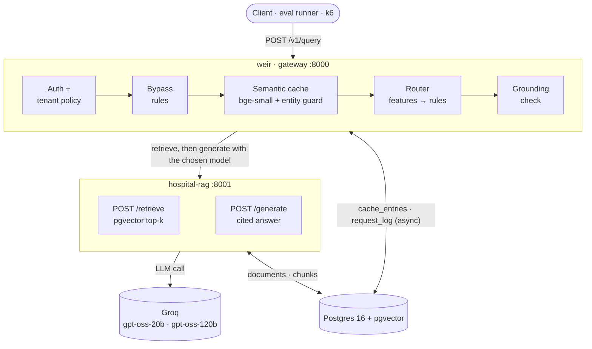
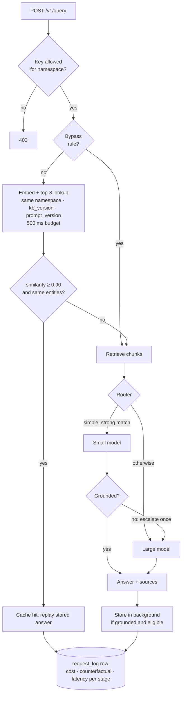
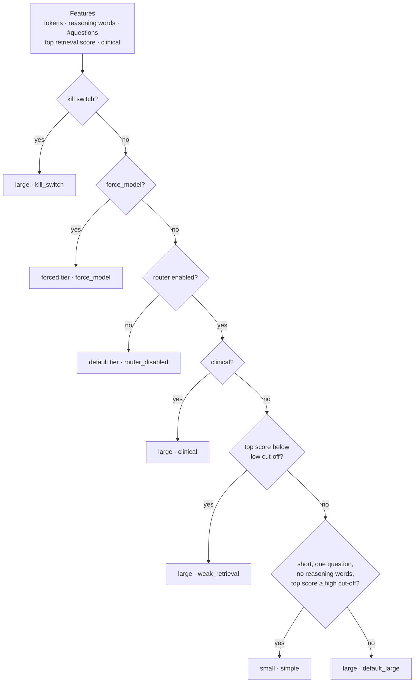

<div align="center">

# Weir

**A cost-aware gateway for RAG: a semantic cache, a model router and per-request cost accounting.**

[](https://github.com/yatinannam/weir/actions/workflows/tests.yml)


-success)

</div>

Weir sits in front of an existing RAG service and decides, for every request:
1. Does this need an LLM call at all? This is the **semantic cache**.
2. Which model is the cheapest that can answer it well? This is the **router**.

It logs the **cost, counterfactual cost and latency of every request**, so each saving is measured, not assumed. Weir is not a retriever, vector database or LLM framework. It wraps a RAG service it does not own.

> [!NOTE]
> **Status:**
> - **Done:** Phases 0–2 (gateway, baseline, semantic cache).
> - **In progress:** Phase 3 (router). Features, rules and the grounding check are built and tested; pipeline integration and offline tuning are next.
> - Everything runs on free tiers.

## Contents

[Results](#results) · [Architecture](#architecture) · [Request lifecycle](#request-lifecycle) · [Semantic cache](#semantic-cache) · [Router](#router-phase-3) · [Stack](#stack) · [Quick start](#quick-start) · [API](#api) · [Configuration](#configuration) · [Evaluation](#evaluation) · [Tests](#tests) · [Docs](#documentation) · [Limitations](#limitations) · [Roadmap](#roadmap)

---

## Results

These are measured on *Weir General Hospital*, a fictional hospital FAQ: 40 documents and 158 eval questions, including look-alike trap pairs. Costs are at provider list prices; actual spend is $0.

| Configuration | Requests | Cache hits | Cost / 1k req | p50 | Judge (1–5) | Key facts | Wrong cache hits |
| :-- | --: | --: | --: | --: | --: | --: | --: |
| Baseline: no cache, always large model | 158 | 0% | $0.0980 | 617 ms | 4.90 | 0.981 | — |
| Cache only, cold pass | 158 | 14.6% | $0.0847 | 686 ms | 4.91 | 0.981 | **0** |
| Cache only, warm replay (73.7% repeats) | 300 | **93.3%** | **$0.0050** | **56 ms** | 4.79 | 0.948 | **0** |

- **−95% cost and 11× lower median latency on repeat-heavy traffic, with no quality loss.** The baseline scores the same 4.79 / 0.948 on that 300-request mix; the lower average comes from the mix, not the cache.
- **The entity guard is what makes caching safe.** At the chosen 0.90 threshold, embedding similarity alone would serve the wrong answer for **37%** of accepted matches (for example "ICU visiting hours" vs "general ward visiting hours"). With the guard, that drops to **0%**.

<p align="center">
  
</p>

Full write-ups:
- [`cache-only.md`](docs/results/cache-only.md)
- [`cache-threshold.md`](docs/results/cache-threshold.md)
- [`baseline.md`](docs/results/baseline.md)

## Architecture



| Service | Role | Owns |
| :-- | :-- | :-- |
| `weir` | The gateway: auth, cache, router, cost accounting, admin API | `weir.cache_entries`, `weir.request_log`, `weir.feedback`, `weir.model_prices` |
| `hospital-rag` | The RAG service being wrapped: ingest, vector retrieval, cited generation, stub LLM mode | `rag.documents`, `rag.chunks`, `rag.kb_versions` |
| `postgres` | pgvector 0.8 with HNSW and iterative scan; only exposed on `127.0.0.1` | — |

## Request lifecycle



Every response carries `X-Request-ID`, which is also the primary key of its log row. The log is written off the request path, so a logging failure never fails a request.

## Semantic cache

| Stage | What happens |
| :-- | :-- |
| **Bypass** | Personalised, time-sensitive ("now", "today"), clinical and follow-up questions never touch the cache. Neither do forced-model requests, a disabled namespace or the kill switch. |
| **Lookup** | The normalised query is embedded with local `bge-small-en-v1.5` (384-d). pgvector returns the top 3 entries for the same `namespace + kb_version + prompt_version` that haven't expired. The step has a 500 ms budget; on timeout the request bypasses the cache. |
| **Entity guard** | A candidate at or above the 0.90 threshold is a hit only if both questions share the same numbers (including number words and ordinals), negation and lexicon terms: wards, departments, people, vehicles, payment, days, buildings and more. The lexicon is in [`entities.yaml`](configs/entities.yaml). |
| **Write-back** | An answer is stored in the background only if it is grounded and cited, retrieval was confident, it isn't "couldn't find" and it wasn't truncated, partial or carrying personal data. |
| **Invalidation** | TTL of 24 h. A `kb_version` change (a content hash of the documents) is picked up by the next miss. `DELETE /v1/cache` purges by namespace, source document or entry. A thumbs-down evicts the entry that served it. |

## Router (Phase 3)



- **Grounding check** (rule-based, no extra LLM call). An answer passes only if:
  - it was found and finished
  - it cites at least one chunk, and every citation is valid
  - it didn't give up partway ("NOT_FOUND" mid-answer)
  - at least `min_overlap` of its content words appear in the cited chunks
- **Escalation and fallback:**
  - A small answer that fails grounding is retried once on the large model.
  - A rate-limited or timed-out tier falls back to the other tier.
  - Never more than 2 model calls per request.
  - Forced and disabled routes never adapt.
- **Offline tuning.** The cut-offs are tuned without a single model call: the router replays both models' measured answers to all 158 questions over a 900-setting grid. The cheapest setting that meets the quality bar wins. The bar is "no visible loss" (D33):
  - judge within 0.1 of the baseline
  - facts no lower
  - the small route no worse than the large model on the same questions

## Stack

| Layer | Choice | Why |
| :-- | :-- | :-- |
| API | Python 3.12, FastAPI, uvicorn, `uv` | Async I/O, typed request models, fast installs |
| Vector store | Postgres 16 + pgvector 0.8 (HNSW, `iterative_scan = relaxed_order`), psycopg 3 async pool | One database for vectors, cache metadata and logs; filtered ANN without recall loss |
| Embeddings | `BAAI/bge-small-en-v1.5` via fastembed (CPU, baked into images) | Free, offline, no PyTorch |
| LLMs | Groq free tier: `openai/gpt-oss-20b` (small), `openai/gpt-oss-120b` (large) | Fast; separate per-model quotas allow fallback |
| Eval judge | `qwen/qwen3.8-27b` on Groq | A different model family from the models under test |
| Packaging and CI | Docker Compose, GitHub Actions (3 suites against pgvector) | — |
| Planned | Prometheus + Grafana (Phase 4), k6 (Phase 5) | — |

## Repository layout

```text
services/
├── weir/               gateway
│   └── src/weir/
│       ├── pipeline.py     request pipeline: bypass → cache → retrieve → route → generate → log
│       ├── cache/          embedder, pgvector store, entity guard, bypass rules, kb versions
│       ├── router/         features, rules v1, grounding check            (Phase 3)
│       ├── rag/            hospital-rag HTTP adapter
│       ├── metrics/        async request-log writer
│       └── llm/            price table (effective-dated)
└── hospital-rag/       the RAG service Weir wraps: ingest, /retrieve, /generate, stub LLM
eval/                   eval set (158 questions), key-fact checks, LLM judge, runner,
                        threshold sweep, workload replay; reports/ holds every raw result
kb/                     fictional hospital knowledge base (40 Markdown docs, public + staff)
configs/                weir.yaml (every threshold), ablations/, entities.yaml, tenants.yaml, prices.yaml
db/migrations/          001 init · 002 cache · 003 router
docs/                   specs, plans, decision log, progress log, results, backlog
```

## Quick start

**Prerequisites:**
- Docker Desktop and [uv](https://docs.astral.sh/uv/)
- a free [Groq API key](https://console.groq.com/keys)

```bash
cp .env.example .env
# Fill in GROQ_API_KEY, then generate three tenant keys (WEIR_KEY_PUBLIC / _STAFF / _ADMIN):
uv run python -c "import secrets; print(secrets.token_urlsafe(24))"

docker compose up -d --build                     # postgres, migrations, hospital-rag, weir
docker compose exec hospital-rag python -m hospital_rag.ingest --kb /app/kb
```

> [!TIP]
> **On Windows:**
> - In Git Bash, prefix the `exec` command with `MSYS_NO_PATHCONV=1`.
> - Use `127.0.0.1` rather than `localhost`, which can stall on IPv6.

Ask the same question twice. The second time it is a cache hit:

```bash
curl -s http://127.0.0.1:8000/v1/query \
  -H "X-API-Key: $WEIR_KEY_PUBLIC" -H 'content-type: application/json' \
  -d '{"query": "What are the ICU visiting hours?", "namespace": "weir-general/en/public"}'
```

```json
{
  "answer": "The ICU can be visited twice daily: 11 am – 11:30 am and 5 pm – 6 pm…",
  "sources": [{ "id": "pub-visiting-hours-icu", "title": "ICU visiting hours" }],
  "meta": {
    "request_id": "…",
    "cache_status": "hit",
    "similarity": 1.0,
    "route": "none",
    "escalated": false,
    "model": "openai/gpt-oss-120b",
    "latency_ms": 7,
    "cost_usd": 0.0
  }
}
```

Interactive API docs are at <http://127.0.0.1:8000/docs>. Set `LLM_MODE=stub` in `.env` to run without Groq, with fixed-latency fake answers for load tests.

## API

| Endpoint | Auth | Purpose |
| :-- | :-- | :-- |
| `POST /v1/query` | tenant key | Answers a question. Body: `query`, `namespace`, optional `session_id` and `personalized`, `options.bypass_cache`, `options.force_model` (`small` or `large`). |
| `POST /v1/feedback` | tenant key | Body: `request_id`, `rating` (`1` or `-1`), optional `comment`. A `-1` evicts the cache entry that served the request. |
| `DELETE /v1/cache` | admin key | Purges by exactly one of `namespace`, `source_id` or `entry_id`. |
| `GET /healthz` | none | Database and RAG health, plus the active `config_label`. |

Errors carry the `request_id`:
- a provider rate limit → `503` with `Retry-After`
- a timeout → `504`
- a bad upstream response → `502`

## Configuration

Every threshold lives in [`configs/weir.yaml`](configs/weir.yaml), and unknown keys are rejected:
- cache: threshold, candidates, TTL, lookup budget
- bypass keyword lists
- models
- router cut-offs and reasoning words
- grounding `min_overlap`
- kill switches
- per-namespace policy

Experiments change config, not code. Ablations are overlays selected with `WEIR_ABLATION=<name>`:

| Overlay | Cache | Router | Purpose |
| :-- | :-: | :-: | :-- |
| `baseline` | off | forced large | The "before" number |
| `cache_only` | on | forced large | Phase 2 result |
| `small_only` | off | off, small | Small-model trial for offline tuning |
| `router_only` | off | on | Router on its own |
| `full` | on | on | Full Weir |

## Evaluation

Every answer is scored two ways:
- **key facts:** canonicalised whole-number matching against the answer key
- **an LLM judge:** a 1–5 rubric, with a disk cache and resumable grading

```bash
cd eval
uv run --env-file ../.env python -m weir_eval validate                    # check the question set against the KB
uv run --env-file ../.env python -m weir_eval run --config baseline --split all --no-judge \
  --weir-url http://127.0.0.1:8000
uv run --env-file ../.env python -m weir_eval rejudge reports/<run>       # grade later; resumable
uv run python -m weir_eval sweep                                          # threshold sweep, no LLM calls
uv run python -m weir_eval make-workload --n 300 --seed 7                 # Zipf-skewed replay order

# Phase 3 router tuning and checks (no model calls)
uv run python -m weir_eval features                                       # router inputs for every question
uv run python -m weir_eval export-grounding reports/<small-trial>         # grounding results from the request log
uv run python -m weir_eval simulate --small reports/<small-trial>         # replay both models over the rule grid
uv run python -m weir_eval gate reports/<run>                             # exit gate vs baseline v3, same questions
uv run python -m weir_eval derive-workload reports/<run> --workload datasets/workload-300-seed7.jsonl --out reports/<name>
```

| Question group | Count | Purpose |
| :-- | --: | :-- |
| Distinct | 35 | Coverage of the KB |
| Paraphrase clusters (13 × 5) | 65 | Cache recall |
| Look-alike trap pairs (24 pairs) | 48 | Cache safety: same wording, different answer |
| Unanswerable | 10 | "Couldn't find" behaviour, never cached |

The set is split 70/30 by cluster into tune and holdout. Every run's raw `results.jsonl` and `summary.md` is committed under [`eval/reports/`](eval/reports/).

## Tests

```bash
docker compose up -d postgres                       # DB tests use 127.0.0.1:5432/weir_test
cd services/weir         && uv run pytest -q        # 219 tests
cd services/hospital-rag && uv run pytest -q        #  39 tests
cd eval                  && uv run pytest -q        # 105 tests
```

CI runs all three suites against `pgvector/pgvector:0.8.0-pg16` on every push.

## Documentation

| Doc | Contents |
| :-- | :-- |
| [`docs/weir-original.md`](docs/weir-original.md) | The original vision: goals, risks, evaluation plan |
| [`docs/superpowers/specs/`](docs/superpowers/specs/) | Implementation design and the per-phase addenda (cache, router) |
| [`docs/superpowers/plans/`](docs/superpowers/plans/) | Task-by-task implementation plans |
| [`docs/decisions.md`](docs/decisions.md) | Every decision with its alternatives and the reason (D0–D36) |
| [`docs/progress.md`](docs/progress.md) | Phase-by-phase log |
| [`docs/results/`](docs/results/) | Baseline, threshold sweep and cache results |
| [`docs/backlog.md`](docs/backlog.md) | Deferred findings and ideas |

## Limitations

- **Small, synthetic benchmark.** There are 158 questions and 24 trap pairs on a fictional KB. "Zero wrong hits" is strong evidence for this set, not a guarantee.
- **Hit rate depends on the workload.** 93% is for a 73.7%-repeat replay; a cold pass with only paraphrases repeating hits 15%.
- **Latency is measured sequentially, not under load.** Load tests come in Phase 5.
- **Grounding is lexical.** Word overlap catches unsupported answers cheaply, but it doesn't understand meaning.

## Roadmap

| Phase | Scope | Status |
| :-: | :-- | :-: |
| 0–1 | Gateway, RAG adapter, request logging, eval set, baseline | ✅ |
| 2 | Semantic cache, entity guard, threshold sweep, cache eval | ✅ |
| 3 | Router: features, rules, grounding check, escalation, offline-tuned cut-offs | 🚧 |
| 4 | Prometheus metrics, Grafana dashboard, alerts | Planned |
| 5 | k6 load tests (cold/warm, ramp, spike, soak), four-way ablation | Planned |
| 6 | Demo chat page, write-up, optional learned router | Planned |
