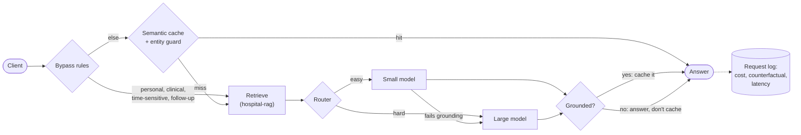

# Weir: a case study

*A cost-aware gateway for a RAG chatbot: a semantic cache, a model router and per-request cost accounting, built and measured on free tiers.*

## TL;DR

Weir sits in front of a retrieval-augmented chatbot and decides, for every question, whether it needs a language model at all (the **semantic cache**) and, if it does, which model is the cheapest one that can answer it well (the **router**). It logs the cost, the cost the same request would have had on the large model with no cache, and the latency of every request, so every saving is measured rather than assumed.

| Measured on *Weir General Hospital* (a fictional FAQ, 158 eval questions) | Baseline | Full Weir |
| :-- | --: | --: |
| Cost per 1,000 requests, repeat-heavy replay (73.7% repeats) | $0.0970 | **$0.0055 (−94%)** |
| Median latency, same replay | 747 ms | **14 ms** |
| Answer quality, same replay (judge 1–5 / key facts) | 4.79 / 0.947 | **4.79 / 0.948** |
| Cost per 1,000 requests, cold pass (each question once) | $0.0988 | **$0.0786 (−20%)** |
| Wrong cache hits (cached answer served for a different question) | n/a | **0** |
| p95 at 10 req/s under load, warm cache (stub model) | 1,439 ms | **15 ms** |
| Errors seen by users under injected model and database faults | n/a | **0** |

Everything runs locally on free tiers (Groq's free API, a local embedding model, Postgres with pgvector). `uv run demo.py` starts it and opens a demo page.

---

## 1. The problem

A hospital FAQ chatbot answers the same few questions all day: visiting hours, parking, fees. A RAG pipeline answers each one from scratch: embed the question, search the documents, send the passages to a model, wait about a second, pay for the tokens. Two things are wasted:

- **Repeats.** "When can I visit the ICU?" and "What are the ICU visiting hours?" deserve the same answer, but they're different strings, so an exact-match cache misses.
- **Over-provisioning.** "What's the orthopedics consultation fee?" doesn't need the large model, but sending everything to the large one is the safe default.

The obvious fixes are dangerous in a hospital setting. A semantic cache that matches on meaning will happily serve the ICU's visiting hours to someone asking about the general ward, because the two questions are almost identical to an embedding model. A router that sends questions to a smaller model can quietly drop a detail, such as a phone extension. So the project was framed as a measurement problem first: **build the baseline and the eval set before any optimization, and only keep an optimization if quality holds.**

Weir is a **gateway**, not a new RAG system. It wraps an existing retrieval service (`hospital-rag`) it doesn't own, which is how this would be deployed in front of a real hospital system.

## 2. Design and trade-offs

**The semantic cache, and why it needs an entity guard.** Questions are embedded locally (bge-small) and matched against earlier ones in pgvector. The threshold (0.90) came from a sweep over 285 labelled question pairs: the lowest similarity at which no trap pair is accepted and the false-hit rate stays under 1%, plus a 0.02 safety margin ([D25, D26, D30](decisions.md); [threshold sweep](results/cache-threshold.md)). Similarity alone wasn't enough: at 0.90, **37% of the matches it accepted would have served the wrong answer** ("ICU visiting hours" vs "general ward visiting hours"). The **entity guard** compares the things a question is about: wards, days, vehicles, departments, numbers. A match only counts if they agree. With it, the false-hit rate on the same pairs is **0%**, and the live runs served **0 wrong cache hits**.

**Only grounded answers are cached** ([D35](decisions.md)). An answer is cached only if it cites the retrieved passages and its words actually come from them. A cache multiplies whatever it stores, so a bad answer cached once would be served to everyone who asks. Later, answers from a fallback to the small model were excluded too ([D40](decisions.md), see §5).

**The router has a strict bar.** Simple features decide the route: question length, how well the top document matches, whether the question asks more than one thing or needs reasoning, and clinical words, which always go large. The cut-offs were tuned offline by replaying both models' answers over a rule grid, with the rule that **no question may get visibly worse** ([D37](decisions.md); [router tuning](results/router-tuning.md)). That bar sends only 13% of questions to the small model, which answered every one of them at 5/5 with full facts. A looser bar would have saved about 38% but made 2 of 158 answers worse, including an invented phone extension. In a hospital FAQ that's a real error, and the cache already delivers the big saving.

**Escalation and fallback.** If a small-model answer fails the grounding check, Weir escalates to the large model once. If a model is down or rate-limited, Weir falls back to the other tier. There's a hard cap of two model calls per request.

**Every request is logged with its counterfactual cost:** what it would have cost on the large model with no cache. "Savings" is then a sum over real rows, not an estimate. The same row feeds Prometheus, so the live counters and the historical dashboard can't disagree.

## 3. How quality was measured

- **The eval set:** 158 questions over a 40-document fictional knowledge base. It has 35 distinct questions, 13 clusters of 5 paraphrases (for cache recall), **24 look-alike trap pairs** (same wording, different answer: weekday vs weekend parking, adult vs child vaccination), and 10 unanswerable questions. It is split 70/30 into tune and holdout.
- **Two scores per answer:** canonicalised key-fact matching against an answer key, and an LLM judge (Qwen, a different model family from the models under test) on a 1–5 rubric.
- **Same-day baselines.** The large model drifted between days: one question that it half-answered on October 1–3 got "couldn't find" every time by October 5 ([router results](results/router.md)). Every comparison therefore uses a baseline run on the same day, so drift affects both sides equally.
- **Gates per phase:** the cache needed 0 trap matches in the sweep, 0 wrong hits live, and cold quality equal to the baseline. The router needed lower cost, judge within 0.1, facts no lower, the small route at least as good as the large, and 0 wrong hits. Both gates passed ([summary](results/summary.md)).

## 4. Results

**The four-way ablation** ([summary](results/summary.md)): baseline (always the large model, no cache), cache only, router only, and full Weir, on two workloads.

| Configuration | Cold: cost / 1k | Cold: judge, facts | Replay: hit rate | Replay: cost / 1k | Replay: p50 |
| :-- | --: | --: | --: | --: | --: |
| Baseline | $0.0988 | 4.90, 0.978 | 0% | $0.0970 | 747 ms |
| Cache only | $0.0847 (−14%) | 4.91, 0.981 | 93.3% | $0.0050 | 56 ms |
| Router only | $0.0921 (−7%) | 4.90, 0.978 | 0% | $0.0936 | 732 ms |
| **Full Weir** | **$0.0786 (−20%)** | **4.90, 0.978** | **93.0%** | **$0.0055 (−94%)** | **14 ms** |

The cache does most of the work on realistic, repeat-heavy traffic. The router adds a smaller, safe saving that shows on cold traffic.

**Under load** ([load-test report](results/loadtest-2026-10-07.md)): 31 k6 runs at constant arrival rates, using a stub model whose delays are fitted to measured Groq latencies (Groq's free tier can't sustain load tests). Retrieval, embeddings, the cache and the router were all real.
- At 10 req/s with a warm cache, full Weir's p95 was **15 ms** against the baseline's **1,439 ms**.
- Highest rate within a 2 s p95 budget on one laptop: **full Weir 100 req/s** in 2 of 3 ramps (p95 about 41 ms), **baseline 60 req/s** (p95 about 1.5 s).
- **Failure injection:** the large model rate-limited, the small model timing out, and Weir's database link delayed by 2 s, each for a minute under traffic. There were **0 user-facing errors** in all 3 runs: 541 and 60 requests fell back to the other model, and 1,191 skipped the slow cache (median p95 1.94 s; one of the three runs reached 2.07 s).

## 5. What went wrong, and what I learned

**Similarity isn't sameness.** The threshold sweep's first lesson was the 37% figure in §2. Embedding models are built to say "these mean the same thing", which is exactly wrong when the difference is one word. The entity guard is small, but without it the cache would be unsafe at any threshold that gives useful hit rates.

**The outage that poisoned the cache.** During one run, Groq's large-model daily allowance ran out. Weir fell back to the small model **113 times and answered 458 of 458 requests**, which is what fallback is for. Then I noticed the stand-in answers had been **cached**, including two known small-model mistakes, and would have been served for 24 hours after the outage ended. Fallback worked, and it created a new failure mode. The fix ([D40](decisions.md)): answers from a fallback down to the small model are never cached. An earlier incident, 20 minutes of HTTP 502s from Groq, also ended with 0 errors, because Weir fell back on the 6 requests affected.

**The model under test moved.** Comparisons against a three-day-old baseline missed the "facts no lower" gate by 0.003–0.006. That traced to the large model itself drifting on two questions, not to Weir. Same-day baselines became a rule.

**Load testing found a real overload mode.** In one of three ramps, full Weir collapsed at 100 req/s. With the CPU saturated by embedding, cache lookups started missing their time budget, and Weir bypassed the cache (by design: a cache outage must never become a user outage). But each bypass turns a 15 ms hit into a full retrieval and model call, which adds load, which causes more bypasses. **1,832 requests fell through** before the run hit k6's 60 s timeout. The safety valve amplified the overload. The next step is to shed load or serve stale entries when lookups time out from saturation ([backlog M31](backlog.md)).

**Testing the tests.** Fresh-context reviewers at the end of each phase kept finding checks that would pass without evidence:
- a failure-injection check where every request was a cache hit, so the injected model faults never met a request ([D54](decisions.md))
- a spike "recovery time" of 10 s for a system that never left its budget
- a "last 5 minutes" memory figure measured when the sampler had already stopped ([D61](decisions.md))

Every check now has to be able to say "not run" instead of "pass".

**Near-misses in the tooling.** The local `.env` says `LLM_MODE=groq`. The first load-test orchestrator would have restarted the RAG service against real models mid-suite and spent the free quota; every Compose call now pins the mode ([D55](decisions.md)). The laptop entered sleep mid-run once, turning a 35-second run into 12 minutes; runs that take far longer than planned are now flagged and repeated ([D57](decisions.md)).

## 6. Limitations

- **A small, synthetic benchmark.** 158 questions and 24 trap pairs is evidence, not proof. "0 wrong hits" holds for this set.
- **Hit rate depends on traffic.** 93% is for a 73.7%-repeat replay; a cold pass where only paraphrases repeat gets 14.6%.
- **Grounding is lexical.** It catches unfinished, uncited and "not found" answers, but not a fluent answer that invents a detail using the source's own words. The strict router bar, not grounding, keeps those questions on the large model.
- **Load tests use a stub model on one laptop,** shared with the load generator. The ceilings are this machine's, not Weir's.

## 7. What I'd do next

- **Shed load instead of bypassing the cache under saturation** (M31), and cap the embedding threads, which spin-wait at about 600% CPU (M33).
- **A learned router:** a small classifier trained on the logged features and outcomes, kept only if it beats the rules on cost at equal quality.
- **Cache warming** from the most frequent questions in past logs, and a cross-encoder check for matches just above the threshold.
- **Harden the RAG service's local port** against DNS rebinding before anyone runs this with a real key on a shared machine (M44).

---

## Resume bullets

- Built **Weir**, a gateway in front of a RAG chatbot combining a semantic cache and cost-aware model routing. On a replayed workload of 300 Zipf-skewed questions it cut LLM cost per 1,000 requests by **94%** and median latency from **747 ms to 14 ms**, with answer quality unchanged (judge 4.79 vs 4.79).
- Designed a **158-question eval set** with paraphrase clusters and **24 look-alike trap pairs**, and built an entity guard that cut wrong cache hits at the chosen 0.90 threshold from **37% to 0%**.
- Logged per-request cost, counterfactual cost and latency to Postgres and Prometheus, with a Grafana dashboard over every run and **8 alerts** covered by **22 promtool tests**.
- Load-tested with k6 (31 runs): p95 **15 ms vs 1,439 ms** for the baseline at 10 req/s on a warm cache, and **0 user-facing errors** under injected model rate limits, model timeouts and a 2 s database delay.
- Shipped a one-command demo (`uv run demo.py`) with a guided page that shows cache hits, guard refusals and routing live.

One or two of these is enough on a resume; the rest are for conversation.

## Interview talking points

**How did you choose the threshold?** From a sweep over 285 labelled pairs, including 24 trap pairs: the lowest similarity where the false-hit rate stayed under 1% and no trap was accepted, plus a 0.02 margin. That gave 0.90, and the live runs confirmed it with 0 wrong hits.

**How do you know quality held?** A fixed eval set, two independent scores (key facts and a judge from a different model family), same-day baselines because the model drifts, and a gate per phase that had to pass before moving on.

**What went wrong?** The outage that cached stand-in answers (D40), or the 100 req/s collapse where the cache's safety valve fed the overload. Both were found by measuring, not by reading code.

**When would you not use a semantic cache?** On low-repeat traffic (the cold pass gets only 14.6% hits), for personalised answers (bypassed by rule), and for fast-changing content (the knowledge-base version is part of the cache key, so an edit invalidates old answers).

**What did each part contribute?** The cache: −94% cost on repeat-heavy traffic. The router: −7% on its own, safely. Together on a cold pass: −20%, with quality identical.

**Why is the router's saving so small?** Deliberately. A looser bar would save about 38% but made 2 of 158 answers worse. I'd rather show the trade-off than hide it.

**How does it behave under load and failure?** It held 100 req/s at about 41 ms p95 in 2 of 3 ramps, against 60 req/s for the baseline. Failures stayed invisible: 0 errors under injected rate limits, model timeouts and a slow database. It also has one real overload mode, which I can explain.

**What would you do next?** Shed load under saturation, try a learned router, and warm the cache from logs.
